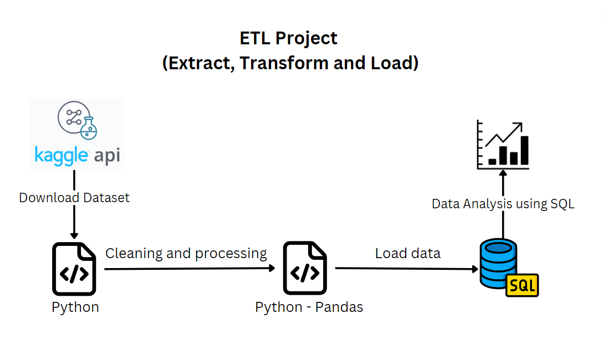

# ETL-Project-Kaggle-Data-Engineering 

## Table of Contents

- [Introduction](#introduction)
- [Project Overview](#project-overview)
- [Dataset](#dataset)
- [Data Cleaning and Transformation Tasks](#data-cleaning-and-transformation-tasks)
- [SQL Analysis](#SQL-Analysis)
- [How to Run the Project](#how-to-run-the-project)
- [Contributing](#contributing)

## Introduction

This project demonstrates a simple ETL (Extract, Transform, Load) process using Python and SQL. The main objective is to extract a dataset from Kaggle, transform it using Python and Pandas, and load it into an SQL database for further analysis.

## Project Overview
  

### Steps Involved:
**Extract**: 
- ***Source***: Kaggle
- ***Method***: Kaggle API to download the dataset
  
**Transform**:
- ***Tool***: Python with Pandas library.
- ***Process***: Loading the cleaned data into an SQL database

**Analyze**:
- ***Tool***: SQL
- ***Process***: Data analysis using SQL queries

## Dataset

This dataset contains 2022 and 2023 global mart sales dataset

## Data Cleaning and Transformation Tasks

- Read data from the file and handle null values

- Rename columns names, make them lower case and replace space with underscore
  
- Derive new columns discount , sale price and profit
  
- Convert order date from object data type to datetime
  
- Drop cost price list price and discount percent columns

## SQL Analysis

Using the transformed data in the Final Staging Layer, perform SQL queries to answer the following five questions:

- **Task 1**: Find top 10 highest reveue generating products 

- **Task 2**: Find top 5 highest selling products in each region
  
- **Task 3**: Find month over month growth comparison for 2022 and 2023 sales eg : jan 2022 vs jan 2023
  
- **Task 4**: For each category which month had highest sales 
  
- **Task 5**: Which sub category had highest growth by profit in 2023 compare to 2022

## How to Run the Project

 **1. Prerequisites**:
- Ensure you have Python and a SQL database installed.
- Install required Python libraries using pip install -r requirements.txt.

**2. Download and process dataset**: 
- Use the provided Python script to download and process the dataset.

**3. Load Data**:
- Load the cleaned data into the SQL database.

**4. Analyze Data**: 
- Run the SQL queries to answer the specified questions.

## Contributing

Contributions are welcome! If you would like to contribute to this project, please follow these guidelines:

1. Fork the repository.
2. Create a new branch for your feature or bug fix.
3. Make your changes and ensure they work as expected.
4. Commit your changes and create a pull request.

